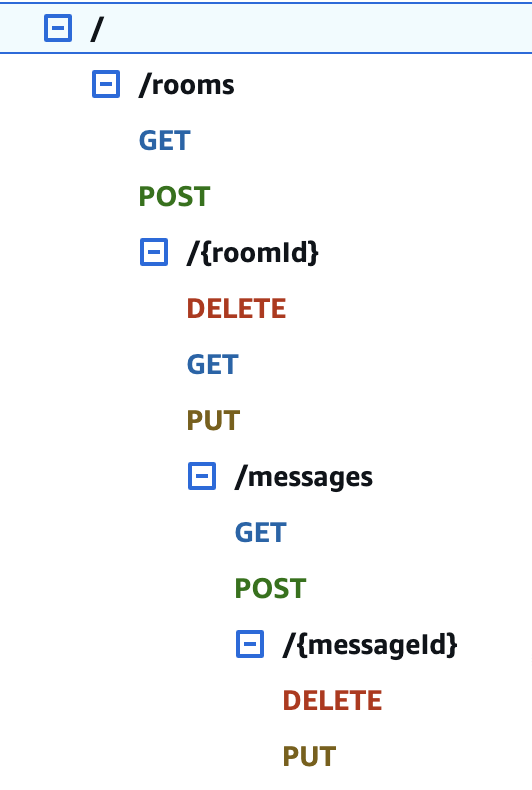

# AWS Serverless Chat App

This project demonstrates a complete serverless backend architecture for a hypothetical chat application using AWS
resources. It is designed to showcase various features in Terraform and AWS services, implementing best practices for
resource management and modular design.

---

## Project Structure

The project is organized into the following structure:

```
├── modules
│   ├── foundation
│   │   ├── main.tf
│   │   └── variables.tf
│   └── rest
│       ├── main.tf
│       └── variables.tf
└── variables.tf
```

### Features

The main purpose of this project is to demonstrate various serverless features and how to handle them with Terraform,
although it is a valid chat app RESTful API, implemented with Lambda, API Gateway, and DynamoDB, it just lacks the
actual business logic.

- serverless API implemented with AWS API Gateway, offers a full set of CRUD operations on `Room` and `Message` models
- the API is authorized with a dummy [Lambda authorizer](chat/authorizer) that always returns the same permissive policy
  restricted to the given endpoint. **NB**: the API looks for the credential in the `username` query parameters (chosen
  for convenience of testing)
- most endpoints
  are [Proxy integrations with AWS Lambda](https://docs.aws.amazon.com/apigateway/latest/developerguide/set-up-lambda-proxy-integrations.html)
  which is likely the most common integration pattern. API Gateway redirects the request to the Lambda service as-is and
  Lambda is responsible for both the business logic and formatting.
- some endpoints, e.g. `DELETE /rooms/{roomId}` are MOCK endpoints, which means they, even though they lack their
  backend, take full responsibility for the content and formatting of the response
- `DELETE /rooms/{roomId}/messages/{messageId}` is of type `AWS` which means it is a direct integration with an AWS
  service - in this case, DynamoDB. It completely bypasses the compute layer, forms a dynamic request
  with [VTL](https://docs.aws.amazon.com/apigateway/latest/developerguide/api-gateway-mapping-template-reference.html) (
  assuming that messages are stored in their table with `ROOM#{roomId}` as the hash key and `MSG#{messageId}` as the
  range key) and returns a response to the client based on the response from the DynamoDB service (either an empty 204
  or 404 with a message).
- both the authorizer and the API lambdas re-use the library that combines the business logic. The library is packaged
  into a Lambda layer
- the API Gateway has a request validator attached ot it that compares the incoming request against the endpoint's
  respective model (e.g. in `POST /rooms`) and returns a 400 if validation fails.
- optionally, our Terraform allows to attach a custom DNS record to our main API stage.

## API Endpoints

API has the following structure:

and represents the full CRUD on both `Room` and `Message` models
---

### Modules

1. **foundation**
    - Contains foundational resources that are shared across the application and rarely change.
    - Resources include:
        - DynamoDB table for storing chat data.
        - IAM roles and policies for fine-grained access control.
        - Lambda layers and the authorizer Lambda function.

2. **rest**
    - Defines the REST API infrastructure for the chat application.
    - Resources include:
        - API Gateway REST API setup.
        - Methods, integrations, and deployment stages for API endpoints.
        - Lambda functions for handling API requests.

---

## Resources Overview

### Foundation Module

- **DynamoDB Table**
    - Stores chat data such as rooms, messages, and user interactions.
    - Resource: `aws_dynamodb_table.chat_database`

- **IAM Roles and Policies**
    - Ensures secure access to DynamoDB, Lambda functions, and API Gateway.

- **Lambda Layer**
    - Provides shared libraries for Lambda functions.

- **Authorizer Lambda Function**
    - Used for custom authorization logic in API Gateway.

### Rest Module

- **API Gateway**
    - Defines REST API endpoints for managing chat rooms and messages.

- **Lambda Function**
    - Handle business logic for API endpoints.
    - Functions are placeholders and do not perform any actions.

- **Deployment and Staging**
    - Manages the deployment of API Gateway.
    - Resources:
        - `aws_api_gateway_deployment.main`
        - `aws_api_gateway_stage.api`

---

## Deployment

### Prerequisites

1. **Terraform**: Install Terraform CLI (v1.8.0+).
2. **AWS CLI**: Configure AWS credentials with appropriate permissions.

### Steps

```shell
# before we begin, we'll make the library layer
cd chatmodels
chmod +x package.sh
./package.sh

# all Terraform config is there
cd ../terraform
# starts the project
terraform init
# creates our environment, see below
touch terraform.tfvars
# lists all planned changes in dry-run
terraform plan
# deploys in main.tf recursively
terraform apply
```

### Config

File at `terraform/terraform.tfvars` may contain the following:

```shell
# our reusable library
chat_lib_path               = "../chatmodels/chat-lib-0-0-1.zip"
# your AWS region of choice
region                      = "ca-central-1"
# AWS CLI profile on local machine
profile                     = "default"
# Optional AWS ACM certificate ARN, in case custom DNS name is provided
api_gateway_ssl_certificate = ""
# Optional DNS name to attach to the API Gateway
custom_domain_name          = ""
```

---

## Notes

- **Demo Purpose**: All Lambda functions are placeholders and do not execute real logic.
- **Modularity**: The project is modular, making it easy to scale or replace specific parts.
- **Security**: IAM roles and policies follow the principle of least privilege.
- **Local deployment**: Unlike AWS CloudFormation, Terraform allows building and uploading layers from local machines
  and we're taking full advantage of that in our setup.

---


